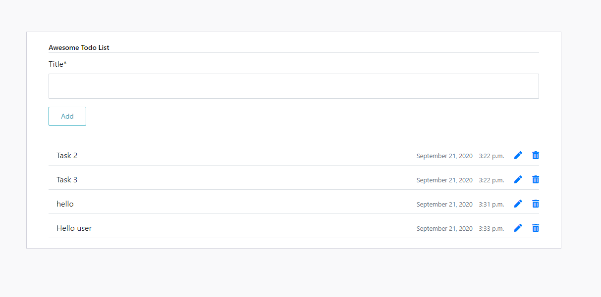
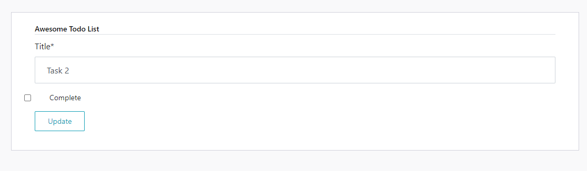
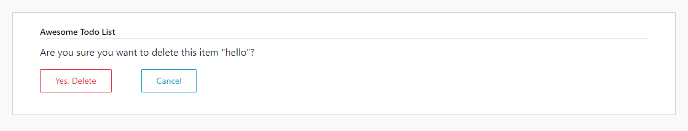

# TodoApp
This is todo app made with Django
# Langauge used:
* HTML, CSS, Bootstrap, Django
 
In this app you can create your to-do list, Edit created tasks, mark as completed and delete them.
created tasks are created with time and date

Home page

Update

Delete

